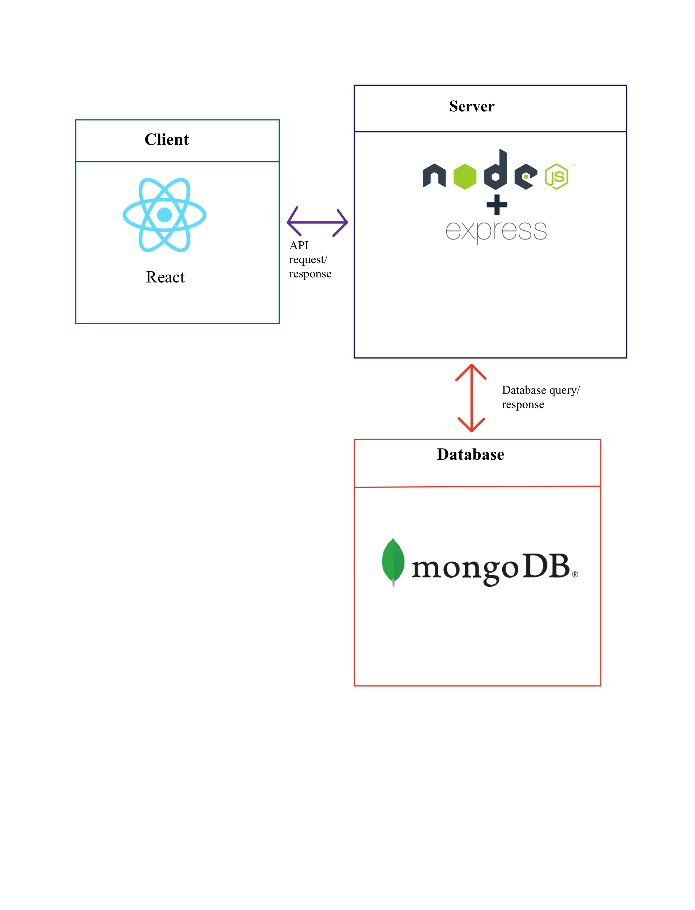

#  StudyBuddy

###  Team Members

| Name | GitHub Username | Email
| --- | --- | --- |
| Abu Sayeed Khan | sayeedkhannabil| khanas1@myumanitoba.ca
| Thomas Livingstone | thomaslivingstone| living11@myumanitoba.ca
| Aaron Nguyen | prosaox| nguyen62@myuamnitoba.ca
| Hasin Ishrak | ishrakHP| ishrakh@myumanitoba.ca

##  Team Leader:

###  Description

`StudyBuddy` is a web based tool to help students to better manage their schedule. With `StudyBuddy`, students can add their courses and track their assignments, quizes, midterms and final exam deadlines. Additionally, Users can schedule their own personal routine to create better study habits. Overall, students will be able to track their progress throughout their desired time period, and track if they are progressing towards their individual goals.

### Core Features

> * All registered users can add courses that they want to keep track of to their account.
> > * Different course related activities such as assignments, exams and projects can be added to each course to:
> > > * Make schedule and get notifications about their deadlines
> > > * Add grades of each activities
> > > * Create goals and track progress towards that goal by already achieved grades
> > * Personalized tasks can be created and scheduled.

###  Languages and Tools

###  Meeting Notes

###  System Architecture Design

